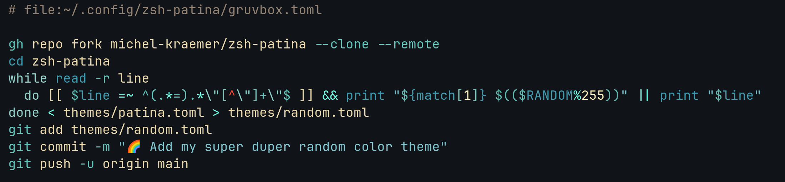

# zsh-patina-creamsody

a zsh-patina theme based on [Creamsody](https://github.com/emacsfodder/emacs-theme-creamsody)



# Usage

refer to [zsh-patina](https://github.com/michel-kraemer/zsh-patina)

copy [`creamsody.toml`](creamsody.toml) to `~/.config/zsh-patina/creamsody.toml`

Edit/create `~/.config/zsh-patina/config.toml`,

Place `theme = "file:~/.config/zsh-patina/creamsody.toml"` in `[highlighting]` 

e.g.

```toml
[highlighting]

theme = "file:~/.config/zsh-patina/creamsody.toml"
```

# License

MIT

# Support

Add an issue to [/issues](https://github.com/ocodo/zsh-patina-creamsody/issues)
